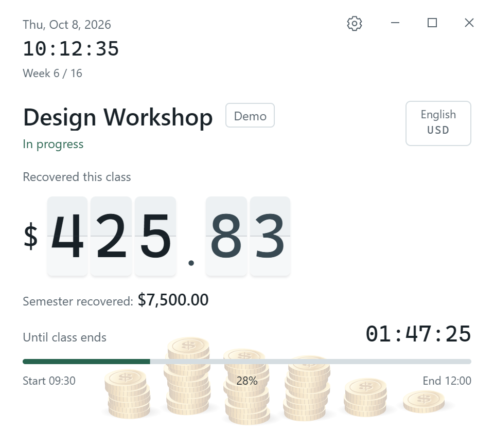

# Tuition Payback Timer

English | [简体中文](README.zh-CN.md)

Watch your tuition “pay for itself,” one second of class at a time.

A small, tongue-in-cheek classroom timer. Enter your semester tuition and timetable, and the app spreads the cost across every second of scheduled class. The amount ticks up while class is in session, with a coin dropping for every 10 currency units recovered.

[Download for Windows](https://github.com/Masonli1203/tuition-payback-timer/releases/latest) · [User guide](docs/usage.en.md) · [MIT license](LICENSE)

## Why this exists

The tuition is already paid, and you still have to go to class. Here is a slightly sarcastic way to look at it: every second you sit through is a little money earned back.

This project turns an abstract tuition bill into a rolling number and a growing pile of coins. There is something satisfying about watching today's classes chip away at it. It has a reminder to pay attention, too, but the main point is to make yourself laugh a little.

“Payback” is a visual metaphor based on your timetable. The app knows class times and tuition, but cannot tell whether you attended, paid attention, or got your money's worth. Classes that have already ended count toward the semester total even if the app was closed.

## Features

Version **0.2.10** includes a Windows x64 desktop app and a version you can run in a local browser. First launch defaults to **English** and **USD**, regardless of your system language. Upgrading preserves your saved language and currency.

| Feature | How it works |
| --- | --- |
| Timetable-based timer | Shows the current class, recovered amount, time remaining, and progress; between classes, shows the next class and its countdown |
| Semester total | Adds each full class when it ends and recalculates from the current timetable when reopened |
| Timetable editor | Supports multiple classes per day, individual course date ranges, excluded dates, and overnight classes; rejects overlapping sessions |
| Tuition and hours preview | Calculates actual scheduled hours and the per-second rate; enter durations in whole hours and minutes |
| Flipping digits and coins | Updates on whole seconds and animates only changing digits; drops a coin for each 10 currency units during the current class |
| Desktop window | Starts at 480 × 420 with dragging, always-on-top, minimize, and maximize controls; shows “Focus on class!” or “Rest well!” when maximized |
| Automatic light and dark themes | Uses light mode from 07:00 to 19:00 and dark mode otherwise, based on the device's local clock |
| Languages and currencies | Six interface languages and twelve currencies, selected independently; course names stay as entered |
| Import and backup | Imports supported ICS calendars and full JSON backups, with a preview before confirmation |
| Local storage | Desktop files are backed up before replacement; the browser version uses local storage |



*Screenshot uses a sample timetable.*

Languages: English, 简体中文, 日本語, 繁體中文, 한국어, Español.

Currencies: USD, CNY, JPY, EUR, GBP, HKD, TWD, KRW, CAD, AUD, SGD, CHF. Changing currency **does not convert exchange rates or change the tuition number you entered**. Recovered amounts use two decimal places for every currency.

## Download and get started

Get these files from [Releases](https://github.com/Masonli1203/tuition-payback-timer/releases/latest):

- `TuitionPaybackTimer_0.2.10_x64-setup.exe`: Windows x64 installer.
- `TuitionPaybackTimer.exe`: run directly; settings still use the same application data directory as the installed version.
- `SHA256SUMS.txt`: SHA-256 checksums for the release files.

The desktop app needs Windows WebView2. It runs without Node.js, Rust, or a development server. This build is unsigned, so Windows may show an unknown-publisher prompt.

On first launch, confirm or change the language and currency. Then open the gear button and enter tuition, semester dates, and courses. You can also import an ICS file, review the timetable, add tuition, and save. With no timetable configured, use the live demo in settings to try the timer and coins.

The app and its calculations run locally. There are no accounts, cloud sync, or remote services.

## How “payback” is calculated

```text
Value per second = semester tuition ÷ total scheduled class seconds
Recovered this class = value per second × elapsed seconds in this class
Recovered this semester = value per second × full duration of all ended classes
```

Total hours come from the actual occurrences of each course, including partial weeks at either end of the semester and excluding canceled dates. Every course uses the same semester-wide per-second rate.

For example, tuition of 24,000 spread over 120 hours works out to 200 per hour, or 400 for a completed two-hour class. These are sample values.

During a class, the displayed amount is truncated to two decimal places; the final class amount is rounded. The semester total is summed at full precision before display to avoid rounding each class separately. Once all classes have ended, the semester total equals the tuition entered.

Calculations use the device's local calendar and actual timestamps. Refreshing, resuming, or reopening recalculates immediately, so the window need not stay open. Editing tuition or the timetable also recalculates earlier totals. There is no separate attendance ledger or historical report.

## Import, storage, and limits

ICS import supports single events and weekly courses with an end condition, including multiple `BYDAY` values, `EXDATE` exclusions, folded lines, and escaped text. ICS files contain no tuition. Confirming the preview loads courses into the editor; save the form to write the configuration.

Biweekly or monthly recurrence, endless recurrence, individual rescheduling, all-day events, and calendars with incompatible time zones are unsupported. If an event cannot be represented, the whole file is rejected with an explanation. See the [ICS support guide](docs/usage.en.md#ics-support). Use an exported JSON backup to transfer a full semester configuration.

Desktop data lives in `%APPDATA%\com.mason.tuition-payback\`: `configuration.json` holds tuition and the timetable, and `preferences.json` holds language and currency. Saving preserves the previous file; a failed save keeps your edits available to retry. Loading never automatically rewrites the source file. Browser data is separate for each browser and origin.

Only Windows x64 binaries are currently published. There are no macOS, Linux, or mobile releases, or standalone widgets. Actual hardware sleep and DPI behavior across multiple devices have not been fully verified.

## Run from source

The interface uses plain HTML, CSS, and JavaScript. The desktop shell uses Tauri 2.

Running the web version locally only requires Node.js. The project has been verified with Node.js 24:

```sh
git clone https://github.com/Masonli1203/tuition-payback-timer.git
cd tuition-payback-timer
npm start
```

Open [http://127.0.0.1:4173/](http://127.0.0.1:4173/). The server listens only on the local machine; set `PORT` to use another port. Native minimize, maximize, and close actions work in the desktop app; their browser counterparts are visual controls only.

To build for Windows, also install the Rust MSVC toolchain (Rust 1.90 or later), C++ Build Tools, Windows SDK, and WebView2:

```sh
npm ci
npm run desktop:build
```

Use `npm run desktop:dev` for development mode. Build outputs are in:

```text
src-tauri/target/release/tuition-payback.exe
src-tauri/target/release/bundle/nsis/
```

Dependencies are pinned by `package-lock.json` and `src-tauri/Cargo.lock`. The `private: true` setting prevents accidental npm publication; the source is open under the MIT license.

## Verification

```sh
npm test
npm ci
npm run test:ui
npm run desktop:prepare
cargo test --manifest-path src-tauri/Cargo.toml
```

The suite contains 72 JavaScript tests and 5 Rust file-storage tests. Three browser regression suites use local Microsoft Edge to cover JSON / ICS, language and currency preferences, save failures and retries, class boundaries, and different window sizes. First-use checks cover seven system locales; saved language choices are preserved.

Native Windows regression requires a separate verification build:

```sh
npm run desktop:build:verification
npm run test:desktop
```

The verification app uses the isolated identifier `com.mason.tuition-payback.locale-verification` and writes sample data only to its test directories. Native checks cover file writes, backups, reopening, reinstalling, legacy drafts, damaged files, and window behavior. Run `npm run desktop:build` again for a production release; do not distribute the verification build.

## Code layout

| File | Responsibility |
| --- | --- |
| `core.mjs` | Class durations, amounts, session selection, and semester totals; the timeline owns the timetable snapshot and calculation cache |
| `app.mjs` | Timer interface, editor, and application state |
| `calendar.mjs` | General ICS parsing and timetable validation |
| `configuration.mjs`, `persistence.mjs` | Configuration formats, migration, backups, and storage adapters |
| `preferences.mjs`, `i18n.mjs` | Languages, currencies, and interface translations |
| `coins.mjs`, `flip-amount.mjs` | Canvas coins and flipping amount digits |
| `desktop.mjs`, `src-tauri/` | Native window controls, file storage, and export |
| `scripts/app-assets.mjs` | Shared public asset list for the local server, desktop build, and UI tests |
| `tests/` | Calculation, storage, import, and interface regression tests |

`scripts/convert-nyu-calendar.mjs` is a separate command-line converter for a specific NYU weekly calendar format. The app's general ICS import uses `calendar.mjs`. See the [converter guide](docs/usage.en.md#command-line-converter) for usage and limits.

## License

[MIT](LICENSE) · Copyright (c) 2026 Mason Li
