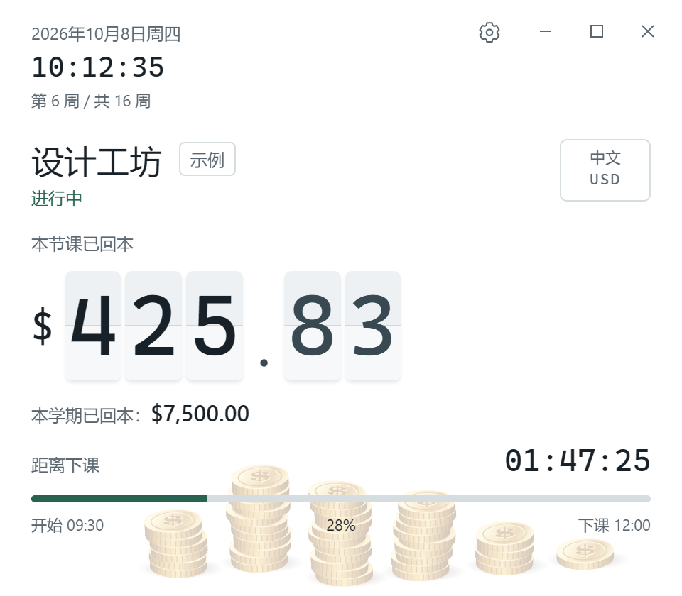

# 学费回本计时器 · Tuition Payback Timer

[English](README.md) | 简体中文

上课的时候，看着学费一秒一秒“赚回来”。

一个带点自我调侃的课堂计时小工具：输入学期学费和课表，把学费均摊到每一秒上课时间。上课时，窗口里的金额逐秒增长，每攒够 10 个货币单位，就掉下一枚金币。

[下载 Windows 版](https://github.com/Masonli1203/tuition-payback-timer/releases/latest) · [使用说明](docs/usage.md) · [MIT 许可证](LICENSE)

## 为什么做这个项目

学费已经交了，课也得上。既然如此，不妨换个有点讽刺的视角：每上一秒课，就当自己赚回了一点学费。

做这个项目，主要是想给上课这件事加一点趣味。把一笔抽象的学费变成眼前不断翻动的数字，再看着金币慢慢堆起来，有一种“今天又回了点本”的满足感。认真上课的提醒也有，不过它首先是个自娱自乐的小玩具。

这里的“回本”是按课表计算的可视化比喻。程序只知道课程时间和学费，不知道你有没有到场、是否专心，也不会衡量一堂课的价值。即使没有打开程序，已经结束的课次也会计入学期累计。

## 现在实现了什么

当前版本为 **0.2.10**，提供 Windows x64 桌面程序和可在本机浏览器运行的网页版本。

| 功能 | 当前行为 |
| --- | --- |
| 按课表自动计时 | 上课时显示当前课程、已回本金额、下课倒计时和进度；课间显示下一节课及开课倒计时 |
| 学期累计 | 只累计完整结束的课次，本节课到下课时一次计入；关闭重开后按当前课表重算 |
| 课表编辑 | 支持一天多节课、每门课独立起止日期、停课日期，以及跨午夜课程；实际重叠的课次会被拒绝 |
| 学费与课时预览 | 根据日期范围内实际出现的课次计算总课时和每秒价值，时长按整数小时、分钟填写 |
| 数字翻页与金币 | 金额按整秒更新，仅变化位翻页；本节课每满 10 个所选货币单位掉一枚金币，换课清零 |
| 桌面窗口 | 默认 480 × 420，可拖动、置顶、最小化和最大化；最大化时按课表显示“好好上课！”或“好好休息！” |
| 自动昼夜配色 | 按设备本地时间切换，07:00 至 19:00 为浅色，其余时间为深色 |
| 语言与货币 | 六种界面语言、十二种计价货币，可分别选择，课程名称保留原文 |
| 课表导入与备份 | 支持部分 ICS 日历规则、完整 JSON 配置导入导出；导入前预览，确认后生效 |
| 本地保存 | 桌面版把配置写入本机文件，覆盖时备份旧文件；网页版使用浏览器本地存储 |



*截图使用示例课表。*

语言：简体中文、English、日本語、繁體中文、한국어、Español。

货币：USD、CNY、JPY、EUR、GBP、HKD、TWD、KRW、CAD、AUD、SGD、CHF。切换货币只改变计价单位，**不会换算汇率，也不会改变输入的学费数值**。所有货币的回本金额都保留两位小数。

## 下载和开始使用

在 [Releases](https://github.com/Masonli1203/tuition-payback-timer/releases/latest) 下载：

- `TuitionPaybackTimer_0.2.10_x64-setup.exe`：Windows x64 安装包。
- `TuitionPaybackTimer.exe`：可直接启动的程序，也使用同一应用数据目录保存设置。
- `SHA256SUMS.txt`：发布文件的 SHA-256 校验值。

桌面版需要 Windows WebView2 运行环境，应用运行时无需 Node.js、Rust 或开发服务器。此版本未做代码签名，Windows 可能显示未知发布者提示。

首次启动默认预选 English 和 USD，可先选语言和货币，再点右上角齿轮，填入学费、学期日期和课程。也可以导入 ICS，核对课表并补填学费后保存。没有课表时，可在设置里载入实时示例，先体验计时和金币效果。

升级会保留已保存的语言和货币选择。

程序运行和课表计算在本机完成，没有账号、云同步或远端服务。

## “回本”怎么算

```text
每秒价值 = 学期总学费 ÷ 学期总上课秒数
本节课已回本 = 每秒价值 × 本节课已过去的上课秒数
本学期已回本 = 每秒价值 × 所有已结束课次的完整秒数
```

总课时按各门课程实际出现的次数统计，包含首尾不足一周的课次，并扣除停课。每门课都使用同一个学期每秒费率。

例如，假设学费为 24,000、总上课时长为 120 小时，则每小时对应 200；一节两小时的课结束时，对应 400。这个例子只是说明算法。

进行中的本节课金额向下截取两位小数，下课后的金额四舍五入。学期累计先汇总完整精度再显示，避免逐节舍入产生误差。全部课程结束时，学期累计等于输入的总学费。

计算使用设备本地日历与真实时间戳。刷新、后台恢复和重新打开时直接重算，不需要让窗口一直运行。修改学费或课表，也会重算之前的累计；当前版本没有独立的出勤账本或历史报表。

## 导入、保存与当前边界

ICS 导入支持单次事件，以及带结束条件的每周重复课程，包含多个 `BYDAY`、`EXDATE` 停课、折行和文本转义。ICS 不含学费；确认预览只是把课程载入编辑区，点击保存才写入配置。

目前不支持隔周或月度重复、无限重复、单独改期、全天事件及跨设备时区的复杂日历。遇到无法表示的事件会拒绝整个文件并提示原因，完整规则见[使用说明](docs/usage.md#ics-支持范围)。迁移整个学期配置请用应用导出的 JSON。

桌面数据保存在 `%APPDATA%\com.mason.tuition-payback\`，其中 `configuration.json` 保存学期和课表，`preferences.json` 保存语言和货币。覆盖保存前会保留旧文件，保存失败时保留编辑内容，启动读取不会自动改写原文件。网页版的数据按浏览器和访问地址分别保存。

当前只发布 Windows x64 安装包，尚无 macOS、Linux 或移动端发行版，也没有桌面外的小组件。实际硬件休眠和多设备 DPI 尚未完整验证。

## 从源码运行

界面使用原生 HTML、CSS 和 JavaScript，桌面壳使用 Tauri 2。

网页本地运行只需要 Node.js。本项目在 Node.js 24 环境验证：

```sh
git clone https://github.com/Masonli1203/tuition-payback-timer.git
cd tuition-payback-timer
npm start
```

打开 [http://127.0.0.1:4173/](http://127.0.0.1:4173/)。服务只监听本机；可通过 `PORT` 环境变量修改端口。网页的最小化、最大化和关闭按钮只是界面展示，原生窗口操作在桌面版可用。

构建 Windows 桌面版还需要 Rust MSVC 工具链（Rust 1.90 或以上）、C++ Build Tools、Windows SDK 和 WebView2：

```sh
npm ci
npm run desktop:build
```

开发模式运行 `npm run desktop:dev`。构建产物位于：

```text
src-tauri/target/release/tuition-payback.exe
src-tauri/target/release/bundle/nsis/
```

依赖版本由 `package-lock.json` 和 `src-tauri/Cargo.lock` 固定。`package.json` 中的 `private: true` 用于避免误发到 npm，不影响本项目按 MIT 许可证开源。

## 验证

```sh
npm test
npm ci
npm run test:ui
npm run desktop:prepare
cargo test --manifest-path src-tauri/Cargo.toml
```

`npm test` 包含 72 项 JavaScript 测试；Rust 文件保存逻辑有 5 项测试。三套网页回归使用本机 Microsoft Edge，覆盖 JSON / ICS、六语偏好、保存失败及重试、课程边界和不同窗口尺寸。

Windows 原生回归需要先构建独立的验证包：

```sh
npm run desktop:build:verification
npm run test:desktop
```

验证包使用独立标识 `com.mason.tuition-payback.locale-verification`，测试只在隔离目录写入示例数据。原生回归覆盖文件写入、备份、重开、覆盖安装、旧版草稿、损坏文件保留和窗口行为。发布正式版本时需重新执行 `npm run desktop:build`，不要分发验证包。

## 代码结构

| 文件 | 职责 |
| --- | --- |
| `core.mjs` | 课时、金额、课次选择和学期累计；时间线封装课表快照与计算缓存 |
| `app.mjs` | 计时界面、编辑器和应用状态 |
| `calendar.mjs` | 通用 ICS 解析与课表校验 |
| `configuration.mjs`、`persistence.mjs` | 配置格式、迁移、备份和存储适配 |
| `preferences.mjs`、`i18n.mjs` | 语言、货币和界面翻译 |
| `coins.mjs`、`flip-amount.mjs` | Canvas 金币动画和金额翻页 |
| `desktop.mjs`、`src-tauri/` | 原生窗口、文件保存和导出 |
| `scripts/app-assets.mjs` | 本机服务、桌面打包和界面测试共用的公开资源清单 |
| `tests/` | 计算、存储、导入和界面回归 |

`scripts/convert-nyu-calendar.mjs` 另提供一个针对固定 NYU 每周日历格式的命令行转换器；应用内通用 ICS 导入使用 `calendar.mjs`。命令行调用方式和限制见[使用说明](docs/usage.md#命令行转换器)。

## 许可证

[MIT](LICENSE) · Copyright (c) 2026 Mason Li
